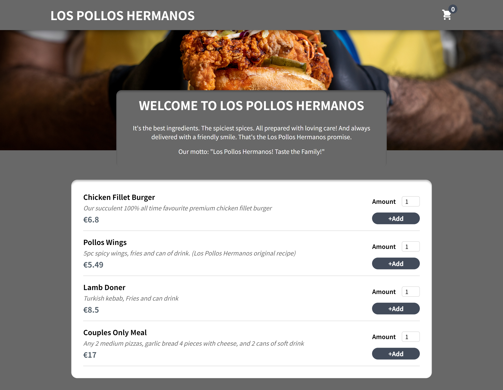

# food-ordering-app

This is a food ordering app called "LOS POLLOS HERMANOS" built with React.js and Vite. It allows users to browse and order food items from a menu. The app utilizes a custom hook, connects to a real-time Firebase database, and makes use of the useContext hook for state management.

# Screenshot



# Live Demo
- [Here](https://food-ordering-app-itsteatv.vercel.app/)

# Features

- User can view the menu with various food items.
- User can add food items to the cart.
- User can view the items in the cart and adjust the quantity.
- User can place an order.
- Real-time synchronization with Firebase database.
- Custom hook implementation.
- Use of React Context API for managing global state.

# Technologies Used

- React.js: A JavaScript library for building user interfaces.

- Vite: A fast build tool for modern web development with React.js.

- Firebase Realtime Database: A cloud-hosted NoSQL database that synchronizes data between clients in realtime.

- Custom Hook: A custom React hook is used to manage the input validation in cart ordering form.

- useContext: The useContext hook is used to provide access to the cart state across different components.

# Getting Started

Prerequisites
Node.js and npm should be installed on your machine.

# Installation

To run the project locally, follow these steps:

1️⃣ Clone the repository:

```bash
  git clone https://github.com/itsteatv/food-ordering-app.git
```

2️⃣ Navigate to the project directory:

```bash
  cd food-ordering-app📝
```

3️⃣ Install dependencies

```bash
  npm install
```

4️⃣ Start the development server:

```bash
  npm run dev
```

# Folder Structure
src
├── components
│   ├── Cart
│   ├── Context
│   ├── Form
│   ├── hook
│   ├── Layout
│   ├── Meals
│   └── UI
├── App.jsx
├── index.css
└── main.jsx

- components: Contains the main components of the app, such as Cart, Meals, Context, Layout, and UI components.
- hooks: use-input Custom hook used in the app
- App.jsx: The root component of the app.
- index.css: Required Styling
- main.jsx: Entry point of the app.

# Usage

- Browse the available food items on the home page.
- Click on the "+Add" button to add items to your cart.
- Adjust the quantity of the items in the cart using the "+" and "-" buttons.
- Review the cart items and the total amount.
- Open the cart to view the selected items and adjust the quantity if needed.
- Click on "order" button and Proceed to checkout form and place your order.

# Contributing

Contributions are welcome! If you find any issues or have suggestions for improvement, please feel free to submit a pull request.

# Acknowledgements

The LOS POLLOS HERMANOS Food Ordering app was developed as part of a React.js learning project and the design inspiration for this project came from the TV show "Breaking Bad". The fictional restaurant "LOS POLLOS HERMANOS" is a trademark of Sony Pictures Television." Special thanks to the creators of React.js, Vite, and Firebase for providing the tools and resources necessary to build this application.

### This app is for educational purposes only.
